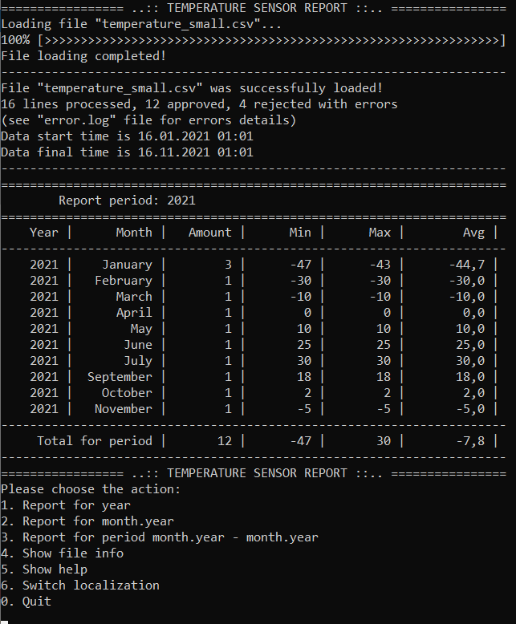

# sensor_data_report
The application reads specified csv-file containing temperature sensor data and forms statistics report.
This is a project for module "Basics of C programming language" of "Embedded Systems Developer" training course.

